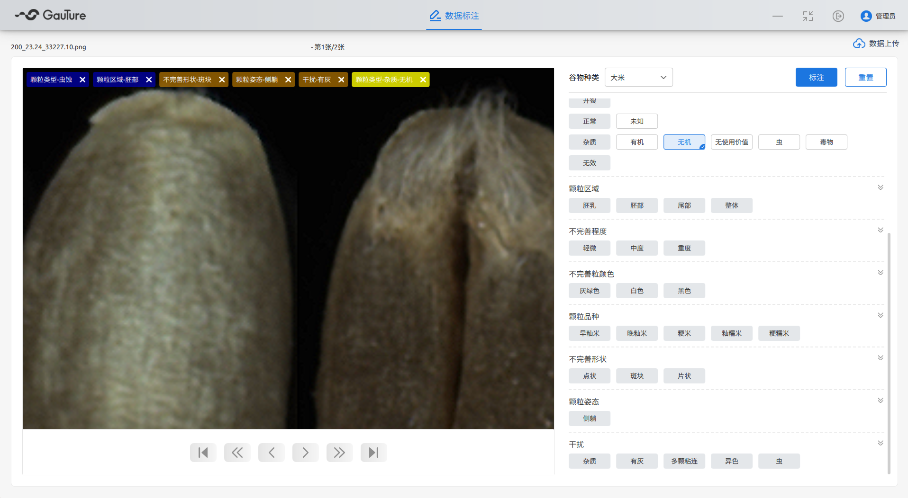
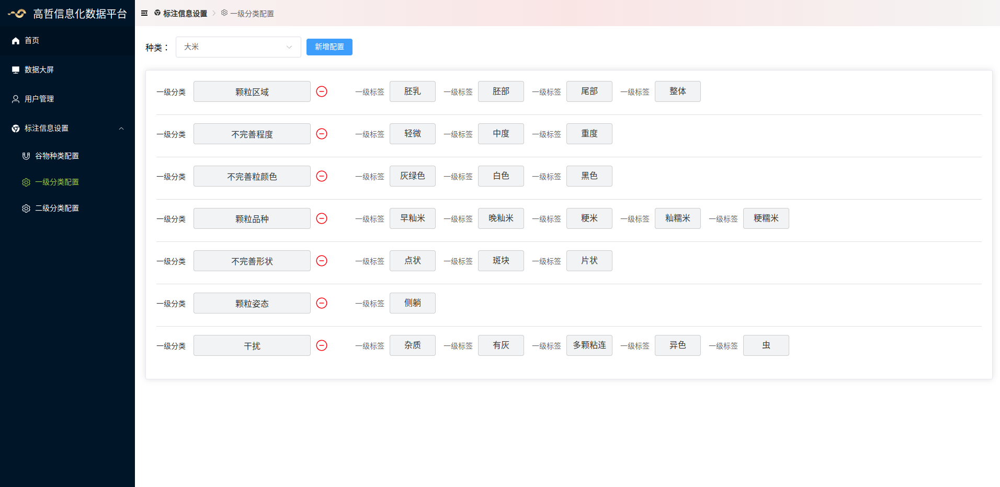

# 介绍
数据标注包含GtLabel客户端，服务一，数据部门获取在线图片。服务二，此项目中node服务，用来配置GtLabel的谷物类型和标签

## GtLabel
谷物标注客户端(Qt/qml+boost)

## 编译环境
1. linux & windows
>- Qt version >= 6.8.0
>- boost version >= 1.85

2. 编译指令

```
cmake -DCMAKE_PREFIX_PATH:PATH=/opt/qt/6.8.2/gcc_64 -B build build;
cmake --build build -j19;
```

### 谷物标注客户端截图


## node server
```
npm install;
node server.js
```

## 前端
vue3 + vite + ts
```
npm install;
npm run dev;
```
### 前端截图


## 前后端部署（docker）
```
docker compose up -d
```

